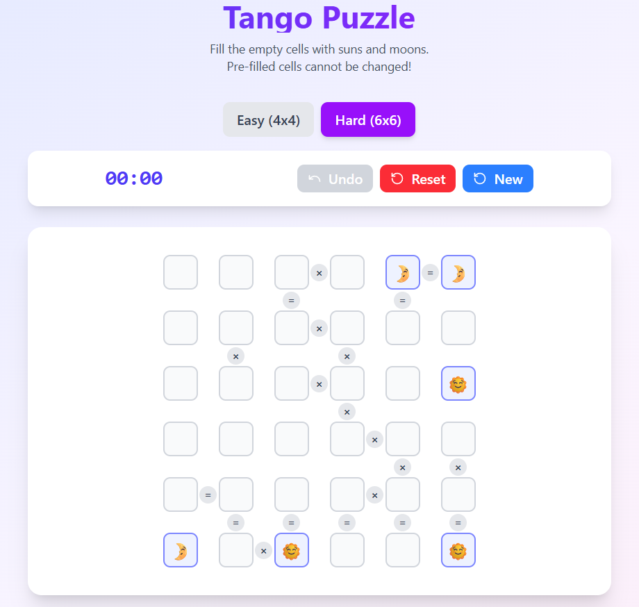

# 🌞🌛 Tango Puzzle Game

[](LICENSE)
[](https://reactjs.org/)
[](https://vitejs.dev/)
[](https://tailwindcss.com/)

A modern web-based **Tango Puzzle Game** inspired by the popular logic puzzle on LinkedIn!  
Built with **Vite**, **React**, and **Tailwind CSS**.

## 🔗 **[Live Demo](https://play-tango.netlify.app)**



---

## 🎮 How to Play

1. **Fill the grid** so that each cell contains either a 🌞 (Sun) or a 🌛 (Moon).
2. **No more than two identical symbols (🌞 or 🌛)** may be adjacent horizontally or vertically.
3. **Each row and column must contain an equal number of 🌞 and 🌛.**
4. Cells separated by an `=` sign must contain **the same symbol**.
5. Cells separated by an `x` sign must contain **different symbols**.
6. **Prefilled cells cannot be changed.** You can only modify the empty cells.
7. Each puzzle is **uniquely generated and solvable through logic only — no guessing required!**

---

## ✨ Features

- **4x4 Easy Mode** – Suitable for beginners.
- **6x6 Hard Mode** – For those who enjoy a tougher challenge.
- **Dynamic Puzzle Generator** – Every puzzle is uniquely generated on each load based on valid constraints.
- **Prefilled Random Cells** – Ensures solvable puzzles without hardcoding.
- **Timer** – Challenge yourself to solve puzzles faster!
- **Undo** – Revert your last move.
- **Reset Button** – Restart the puzzle anytime.
- **Responsive Modern UI** – Clean, minimal design powered by Tailwind CSS.

---

## 🚀 Tech Stack

- **Frontend:** React + Vite
- **Styling:** Tailwind CSS
- **State Management:** React Hooks (useState, useEffect)
- **Puzzle Generator:** Custom logic with constraint satisfaction (no hardcoded puzzles)

---

## 🛠️ Installation & Running Locally

```bash
# Clone this repo
git clone https://github.com/LakhindarPal/tango-game.git
cd tango-game

# Install dependencies
npm install

# Run the app
npm run dev
```

Open [http://localhost:5173](http://localhost:5173) to view it in your browser.

---

## 📦 Build for Production

```bash
npm run build
```

---

## 📄 License

This project is licensed under the [MIT License](LICENSE).

---

## 🌟 Show your support

If you liked this project, give it a ⭐️ on GitHub and share it with others!
